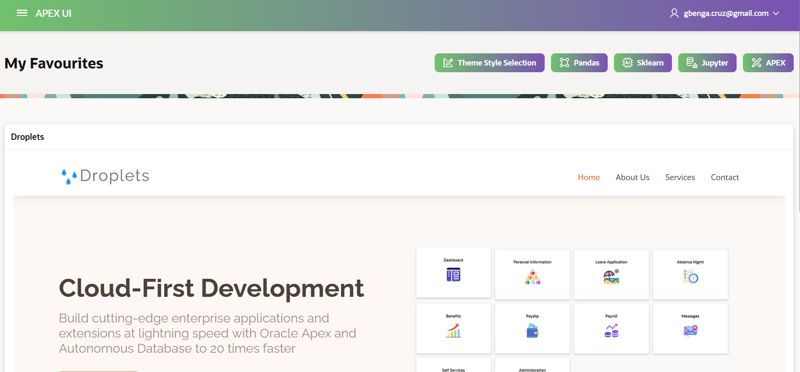
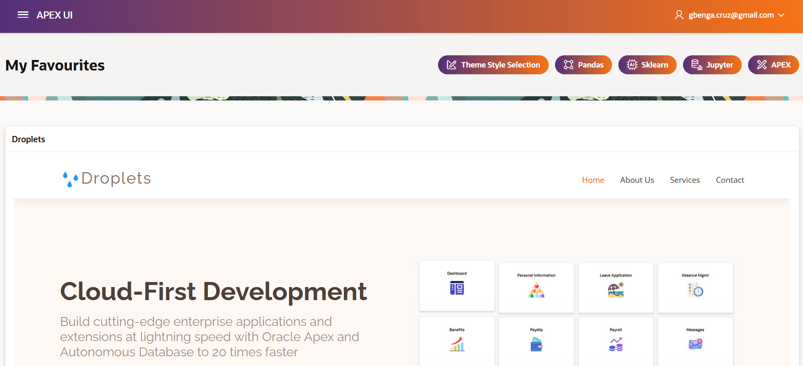
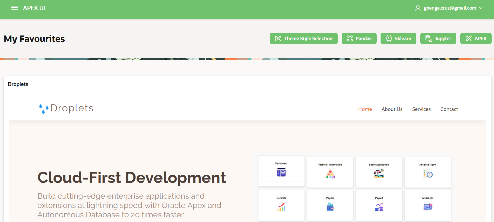

<!DOCTYPE html>
<html lang="en">
<head>
  <meta charset="UTF-8">
  <meta name="viewport" content="width=device-width, initial-scale=1.0">
  <title>Oracle APEX UI Design - GitHub Repository</title>
  
</head>
<body>
  <h1>Oracle APEX UI Design</h1>
  
This repository provides a pre-built Oracle APEX application with customized UI themes and a user-friendly interface. The application is ideal for UI design learning, prototyping, or extension into production use.

  <h2>📥 Importing the APEX App</h2>
  <ol>
    <li>Login to your Oracle APEX workspace.</li>
    <li>Navigate to <strong>App Builder</strong>.</li>
    <li>Click <strong>Import</strong>.</li>
    <li>Upload the file <code>f144.sql</code> provided in this repository.</li>
    <li>Follow the prompts to complete the installation.</li>
    <li>Once imported, open the application to begin customization or exploration.</li>
  </ol>

  <h2>🎨 Changing the Theme Style</h2>
  
To change the theme style dynamically within the app:

  <ol>
    <li>Run the application from the App Builder.</li>
    <li>Navigate to the <strong>Theme Style Selection</strong> component (usually in the settings or navbar).</li>
    <li>Click on the style selector and choose from available styles (e.g., Light, Dark, Custom).</li>
    <li>The UI will update to reflect your selected theme immediately.</li>
  </ol>

  

    <strong>Tip:</strong> Theme styles are controlled via <em>User Interface Attributes</em> in Shared Components. You can also modify or create your own styles there.
  

  <h2>🖼️ Sample Themes</h2>
  
Here are sample screenshots of different UI theme styles available in the application:

  

    
    
    
  

  

  <footer>
    
For more details, visit the official <a href="https://apex.oracle.com/" target="_blank">Oracle APEX site</a>.

  </footer>
</body>
</html>
